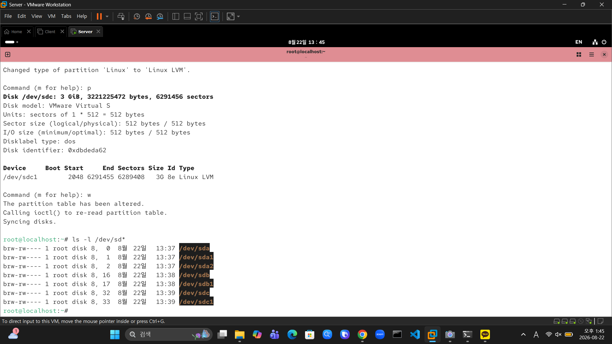
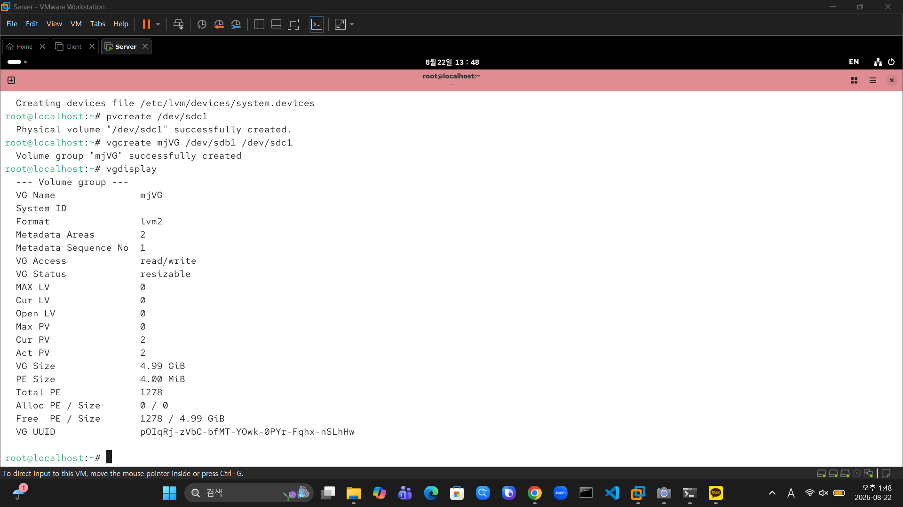
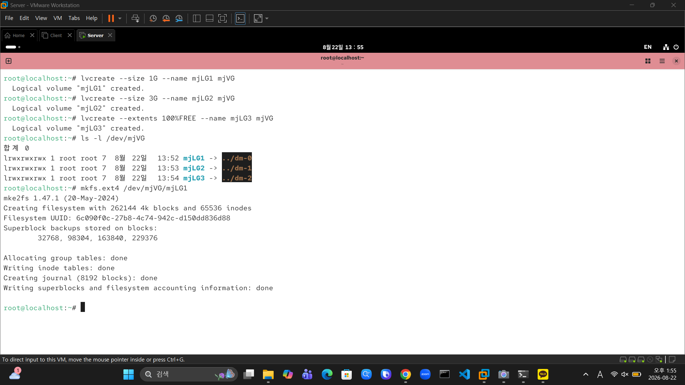
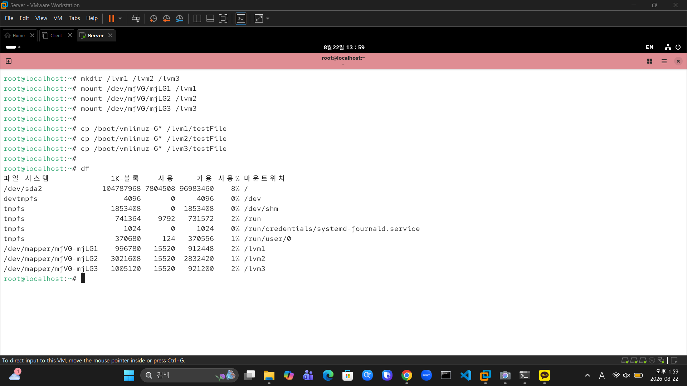

# 📦 LVM (Logical Volume Manager) 유연한 스토리지 관리 실습

여러 물리 디스크를 하나의 논리적 볼륨 그룹으로 묶고, 필요에 따라 자유롭게 용량을 분할하여 사용하는 **LVM(Logical Volume Manager)** 구축 실습 기록입니다.

---

### 🛠️ 실습 환경
* **OS:** Rocky Linux / CentOS
* **Storage:** VMware Virtual Disks (`/dev/sdb`, `/dev/sdc`)
* **Tools:** `fdisk`, `pvcreate`, `vgcreate`, `lvcreate`, `mkfs.ext4`

---

### 📌 주요 실습 요약

| 단계 | 작업 내용 | 사용 명령어 / 주요 설정 |
| :--- | :--- | :--- |
| **1. 파티션 생성** | 디스크 파티셔닝 및 LVM 타입(`8e`) 지정 | `fdisk /dev/sdb`, `/dev/sdc` |
| **2. PV & VG 생성** | 물리 볼륨(PV) 생성 및 통합 볼륨 그룹(`mjVG`) 구축 | `pvcreate`, `vgcreate mjVG`, `vgdisplay` |
| **3. LV 동적 할당** | VG 내 용량 분할(`mjLG1`: 1G, `mjLG2`: 3G, `mjLG3`: 잔여) | `lvcreate --size`, `--extents 100%FREE` |
| **4. 포맷 & 마운트** | `ext4` 파일시스템 생성, 마운트 및 데이터 테스트 | `mkfs.ext4`, `mount`, `cp /boot/vmlinuz-6*` |

---

### 🚀 상세 수행 과정

**1. 디스크 파티셔닝 (`8e` LVM 타입 설정)**  
추가된 물리 디스크`/dev/sdb`, `/dev/sdc`에 파티션을 생성하고 파티션 시스템 타입을 `8e (Linux LVM)`로 변경합니다.



```bash
ls -l /dev/sd*
```

---

**2. Physical Volume(PV) 및 Volume Group(VG) 생성**  
파티션들을 PV로 변환한 뒤, 이를 하나의 가상 대용량 스토리지 그룹인 `mjVG`로 묶어 생성하고 용량(약 4.99 GiB)을 확인합니다.



```bash
# PV 생성 및 Volume Group 통합
pvcreate /dev/sdc1
vgcreate mjVG /dev/sdb1 /dev/sdc1

# Volume Group 상태 및 용량 확인
vgdisplay
```

---

**3. Logical Volume(LV) 할당 및 포맷**  
`mjVG` 볼륨 그룹에서 요청 크기별로 논리 볼륨(`mjLG1`, `mjLG2`, `mjLG3`)을 생성한 후 `ext4` 파일시스템으로 포맷합니다.



```bash
# LV 용량 지정 생성
lvcreate --size 1G --name mjLG1 mjVG
lvcreate --size 3G --name mjLG2 mjVG
lvcreate --extents 100%FREE --name mjLG3 mjVG

# 생성된 LV 심볼릭 링크 확인
ls -l /dev/mjVG

# 파일시스템 포맷
mkfs.ext4 /dev/mjVG/mjLG1
mkfs.ext4 /dev/mjVG/mjLG2
mkfs.ext4 /dev/mjVG/mjLG3
```

---

**4. 마운트 및 데이터 저장 테스트**  
`/lvm1`, `/lvm2`, `/lvm3` 디렉토리를 생성하여 각각의 LV를 마운트하고, 테스트 파일을 복사하여 정상적인 읽기/쓰기 동작을 검증합니다.



```bash
# 마운트 포인트 생성 및 마운트
mkdir /lvm1 /lvm2 /lvm3
mount /dev/mjVG/mjLG1 /lvm1
mount /dev/mjVG/mjLG2 /lvm2
mount /dev/mjVG/mjLG3 /lvm3

# 데이터 복사 테스트
cp /boot/vmlinuz-6* /lvm1/testFile
cp /boot/vmlinuz-6* /lvm2/testFile
cp /boot/vmlinuz-6* /lvm3/testFile

# 파일시스템 마운트 상태 확인
df -h
```

---

### 💡 핵심 요약
* **유연한 공간 관리:** 서로 다른 물리 디스크 두 개를 `mjVG`라는 하나의 그룹으로 합쳐, 물리적 파티션 경계에 제한받지 않고 원하는 크기(`mjLG1`~`mjLG3`)로 유연하게 분할할 수 있음을 확인했습니다.
* **100%FREE 옵션 활용:** 마지막 볼륨 생성 시 `--extents 100%FREE` 옵션을 사용해 VG 내 남은 짜투리 용량을 손실 없이 깔끔하게 할당했습니다.