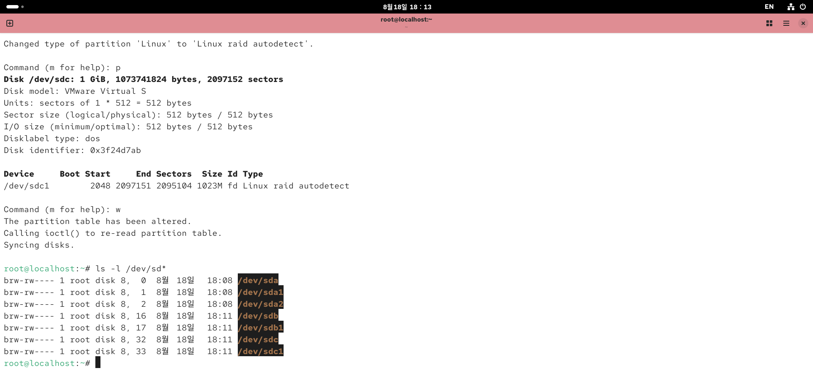
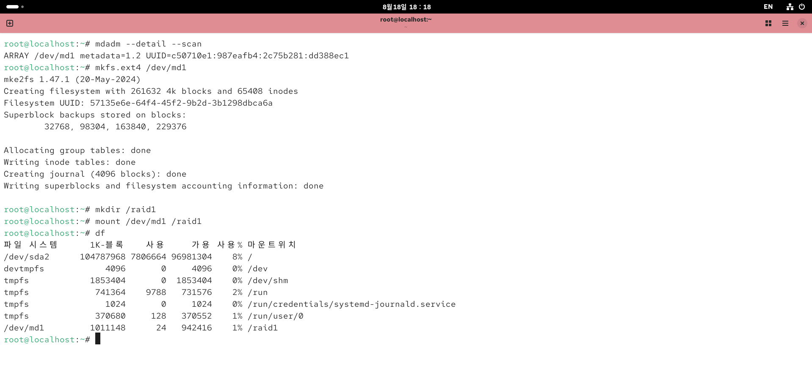
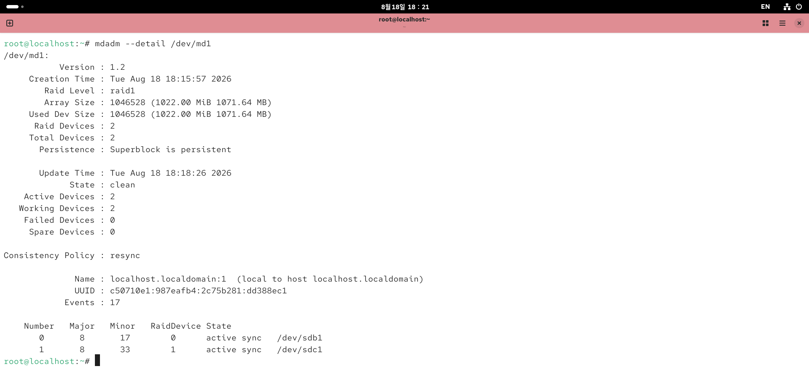
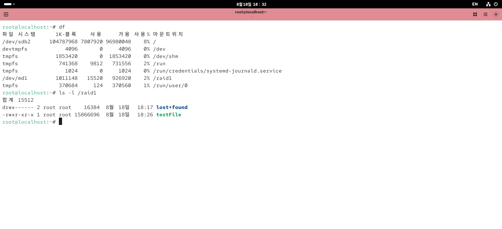
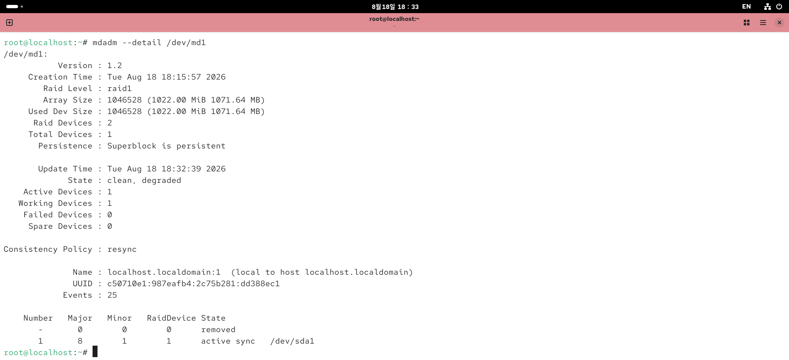

# 🛡️ Software RAID 1 (Mirroring) 구축 및 결함 복구 실습

두 개 이상의 디스크를 미러링(Mirroring) 방식으로 구성하여 데이터의 신뢰성과 내결함성(Fault Tolerance)을 확보하는 **Software RAID 1** 구축 및 장애 복구 실습입니다.

---

## 📌 주요 실습 단계를 한눈에 보기

| 단계 | 작업 내용 | 주요 명령어 / 파일 |
| :--- | :--- | :--- |
| **1. 파티션 생성** | 1GiB 디스크 2개 타입 변경 (`fd Linux raid autodetect`) | `fdisk /dev/sdb`, `fdisk /dev/sdc` |
| **2. RAID 1 생성 & 마운트** | `mdadm`을 통한 `/dev/md1` 생성 및 `ext4` 파일시스템 마운트 | `mdadm --create /dev/md1 --level=1`, `mkfs.ext4` |
| **3. 상태 점검 & 파일 테스트** | 정상 동기화 상태 확인 및 데이터(`testFile`) 저장 | `mdadm --detail /dev/md1`, `ls -l /raid1` |
| **4. 장애 발생 (Fault Simulation)** | 디스크 1개 제거 후 결함 상태(`degraded`) 확인 | `mdadm --detail /dev/md1` |
| **5. 디스크 교체 & 리빌딩** | 새 디스크 추가 및 어레이 재구성 | `mdadm /dev/md1 --add /dev/sdb1` |
| **6. 복구 검증** | 데이터 보존 여부 및 active sync 상태 최종 검증 | `ls -l /raid1`, `mdadm --detail /dev/md1` |

---

### 🚀 상세 수행 과정

**1. 디스크 파티셔닝 (`fd` 타입 설정)**  
새로 추가한 두 디스크 `/dev/sdb`, `/dev/sdc`에 파티션을 생성하고 시스템 타입을 `fd (Linux raid autodetect)`로 지정합니다.



```bash
ls -l /dev/sd*
```

---

**2. RAID 1 어레이 생성 및 마운트**  
`mdadm`으로 RAID 1 어레이(`/dev/md1`)를 생성한 후 `ext4` 포맷 및 `/raid1` 디렉토리에 마운트합니다.



```bash
# RAID 1 생성
mdadm --create /dev/md1 --level=1 --raid-devices=2 /dev/sdb1 /dev/sdc1

# 포맷 및 마운트
mkfs.ext4 /dev/md1
mkdir /raid1
mount /dev/md1 /raid1
```

---

**3. 정상 상태 점검 및 데이터 작성**  
어레이가 `active sync` 상태인지 확인하고 테스트 파일(`testFile`)을 저장합니다.




```bash
mdadm --detail /dev/md1
ls -l /raid1
```

---

**4. 디스크 장애 연출 (Fault Simulation)**  
디스크 한 개를 강제로 이탈시켰을 때 어레이가 `clean, degraded` 상태로 전환되지만 서비스는 중단되지 않음을 확인합니다.



```bash
mdadm --detail /dev/md1
```

---

**5. 디스크 교체 및 자동 리빌딩**  
새 디스크를 장착한 뒤 어레이에 추가하여 리빌딩(Rebuilding)을 진행합니다.


```bash
# 어레이에 새 디스크 편입
mdadm /dev/md1 --add /dev/sdb1
```

---

**6. 복구 및 데이터 무결성 최종 검증**  
동기화 완료 후 두 디스크 모두 `active sync`로 복구되었으며 기존 `testFile` 데이터가 손실 없이 유지됨을 검증합니다.


```bash
mdadm --detail /dev/md1
ls -l /raid1
```