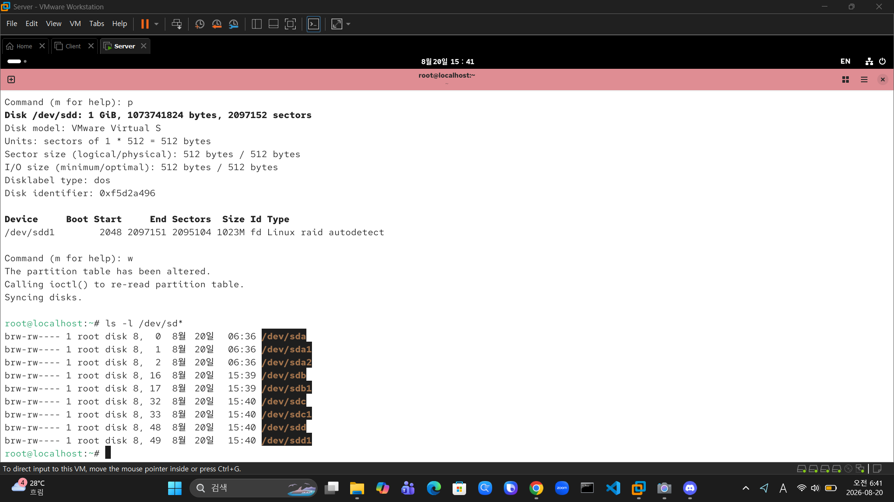
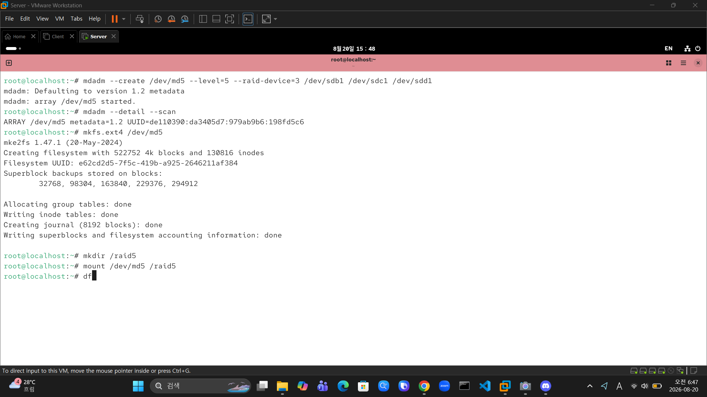
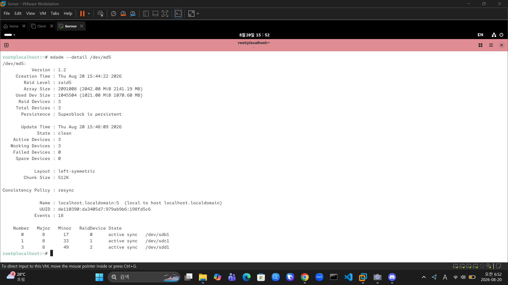
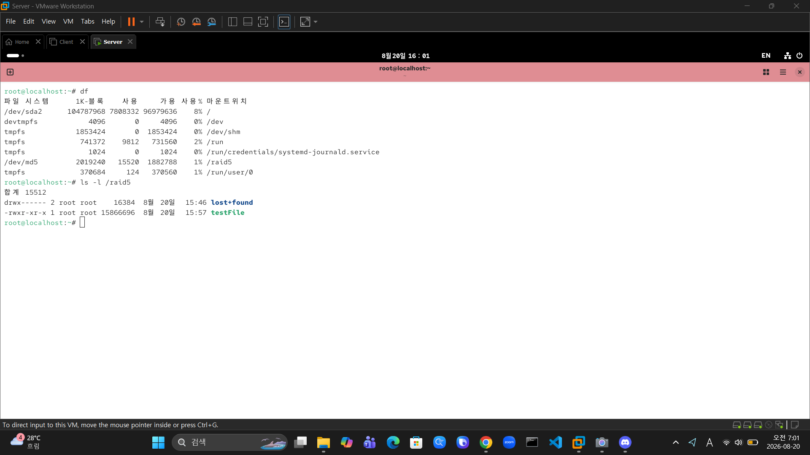
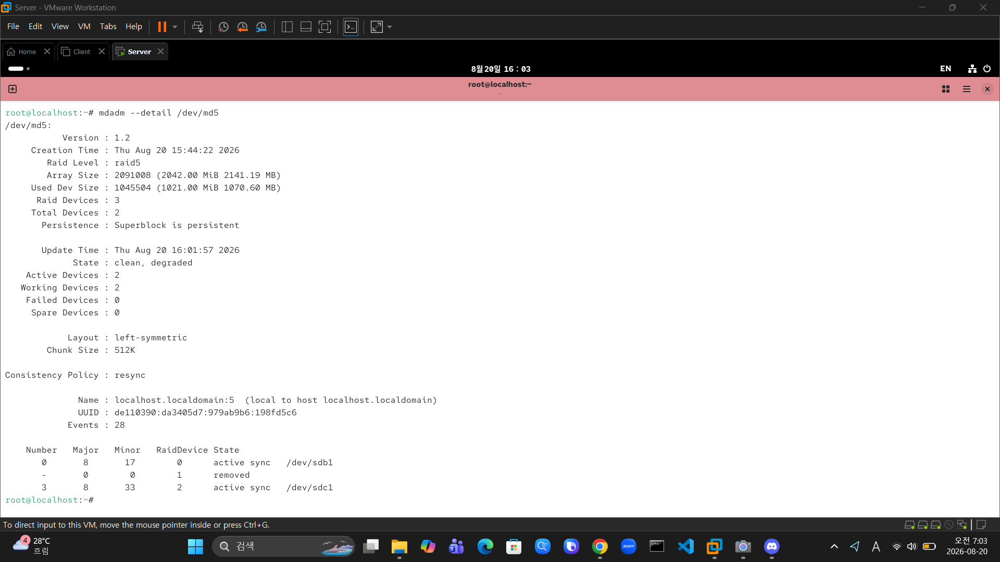
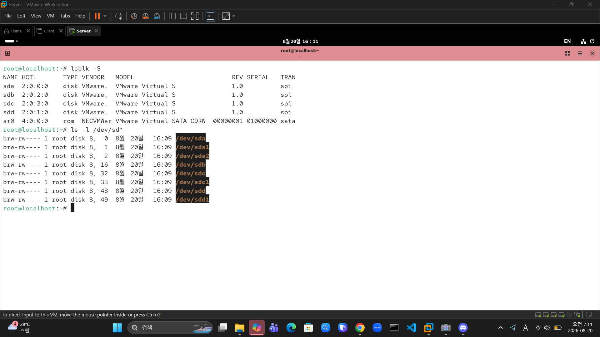
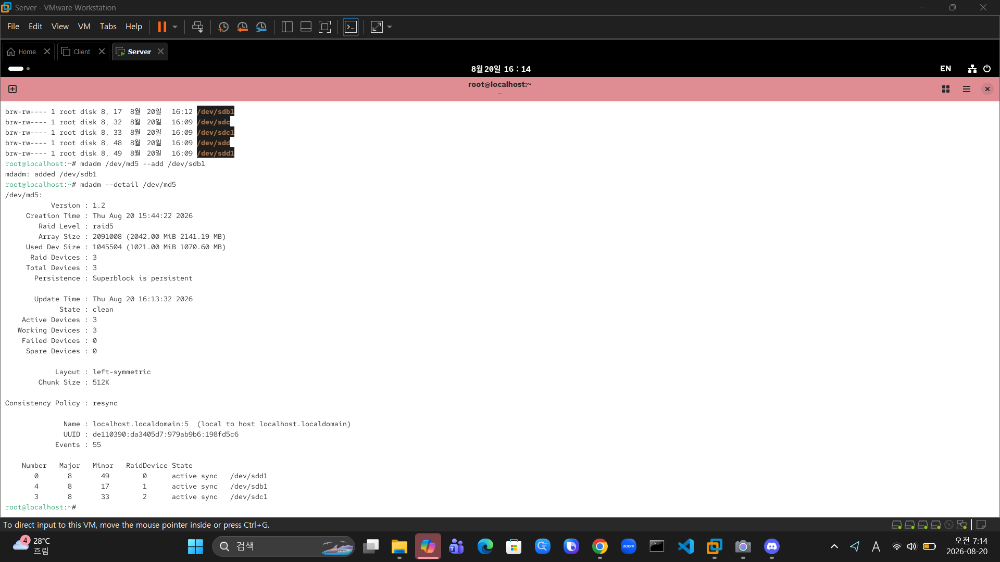

# 🛡️ Software RAID 5 구축 및 결함 복구 실습

패리티(Parity) 분산 저장 방식을 통해 디스크 공간 효율성과 내결함성(Fault Tolerance)을 동시에 확보하는 **Software RAID 5** 구축 및 장애 복구 실습 기록입니다.

---

### 🛠️ 실습 환경
* **OS:** Rocky Linux / CentOS
* **Storage:** VMware Virtual Disks (1GiB × 3)
* **Tools:** `fdisk`, `mdadm`, `mkfs.ext4`

---

### 📌 주요 실습 요약

| 단계 | 작업 내용 | 사용 명령어 |
| :--- | :--- | :--- |
| **1. 파티션 생성** | 3개 디스크 파티셔닝 및 RAID 타입(`fd`) 설정 | `fdisk /dev/sdb`, `sdc`, `sdd` |
| **2. RAID 5 구성 & 마운트** | `mdadm` 기반 `/dev/md5` 생성 및 파일시스템 마운트 | `mdadm --create`, `mkfs.ext4`, `mount` |
| **3. 상태 점검 & 데이터 저장** | 패리티 동기화 상태 확인 및 테스트 데이터 작성 | `mdadm --detail`, `ls -l /raid5` |
| **4. 장애 발생 (Simulation)** | 디스크 1개 강제 이탈 후 결함 상태(`degraded`) 확인 | `mdadm --detail /dev/md5` |
| **5. 디스크 교체 & 리빌딩** | 새 디스크 추가 및 어레이 재구성 | `mdadm /dev/md5 --add /dev/sdb1` |
| **6. 복구 검증** | 패리티 기반 데이터 복구 및 동기화 최종 검증 | `ls -l /raid5` |

---

### 🚀 상세 수행 과정

**1. 디스크 파티셔닝 (`fd` 타입 설정)**  
새로 추가한 세 디스크 `/dev/sdb`, `/dev/sdc`, `/dev/sdd`에 파티션을 생성하고 시스템 타입을 `fd (Linux raid autodetect)`로 지정합니다.



```bash
ls -l /dev/sd*
```

---

**2. RAID 5 어레이 생성 및 마운트**  
`mdadm`으로 RAID 5 어레이(`/dev/md5`)를 생성한 후 `ext4` 포맷 및 `/raid5` 디렉토리에 마운트합니다.



```bash
# RAID 5 생성 (디스크 3개)
mdadm --create /dev/md5 --level=5 --raid-device=3 /dev/sdb1 /dev/sdc1 /dev/sdd1

# 파일시스템 포맷 및 마운트
mkfs.ext4 /dev/md5
mkdir /raid5
mount /dev/md5 /raid5
```

---

**3. 정상 상태 점검 및 데이터 작성**  
어레이가 `clean` 및 `active sync` 상태인지 확인하고, 테스트 파일(`testFile`)을 저장하여 패리티 보호를 받는 데이터 저장을 완료합니다.




```bash
mdadm --detail /dev/md5
df -h /raid5
ls -l /raid5
```

---

**4. 디스크 장애 연출 (Fault Simulation)**  
디스크 한 개를 강제로 이탈시켰을 때 어레이가 `clean, degraded` 상태로 전환되지만, 패리티 연산을 통해 데이터 손실 없이 정상 서비스됨을 확인합니다.



```bash
mdadm --detail /dev/md5
```

---

**5. 디스크 교체 및 자동 리빌딩**  
새 디스크를 장착한 뒤 어레이에 추가하여 백그라운드에서 패리티 재구성(Rebuilding)을 진행합니다.




```bash
# 어레이에 새 디스크 편입
mdadm /dev/md5 --add /dev/sdb1
```

---

**6. 복구 및 데이터 무결성 최종 검증**  
동기화 완료 후 세 디스크 모두 `active sync`로 복구되었으며 기존 `testFile` 데이터가 손실 없이 유지됨을 검증합니다.

```bash
mdadm --detail /dev/md5
ls -l /raid5
```

---

### 💡 핵심 요약
* **공간 효율성 및 가용성:** $N-1$ 디스크 용량만 사용 가능하지만(3GiB 중 2GiB), 1개 디스크 결함 시에도 패리티를 이용해 데이터를 완벽 복구함을 확인했습니다.
* **리빌딩 복구 메커니즘:** `mdadm --add` 명령으로 디스크 투입 시 실시간 패리티 복산 및 리빌딩 프로세스가 안정적으로 동작함을 검증했습니다.